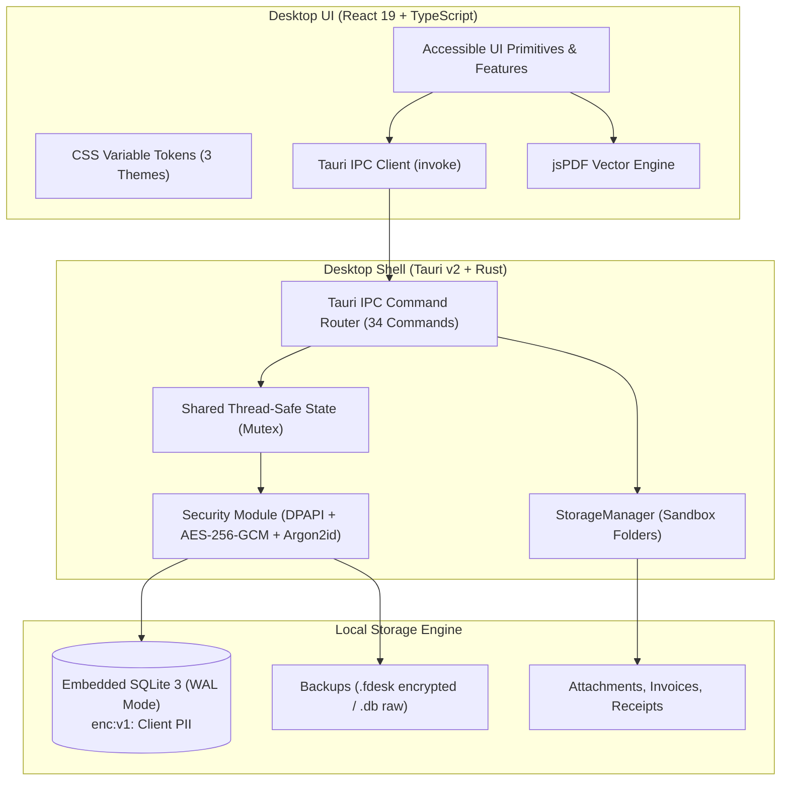

# FreelanceDesk

<div align="center">


### The Artisanal Digital Ledger for Independent Freelancers & Creators

**Offline-first • Privacy-focused • No Accounts • No Subscriptions • Zero Cloud Lock-in**

[](https://tauri.app/)
[](https://www.rust-lang.org/)
[](https://react.dev/)
[](https://www.typescriptlang.org/)
[](https://tailwindcss.com/)
[](https://www.sqlite.org/)
[](#-data-storage-privacy--security)
[](https://vitest.dev/)
[](https://microsoft.com/windows)
[](LICENSE)

[Features](#-key-features) •
[Architecture](#-architecture--tech-stack) •
[Quick Start](#-quick-start) •
[Building & Packaging](#-production-build--packaging) •
[Documentation](#-documentation)

</div>

---

## 📖 Overview

**FreelanceDesk** is a fast, lightweight, and offline-first desktop application designed specifically for digital artists, writers, designers, developers, photographers, and independent service providers. 

Rather than burdening solo creators with bloated corporate CRM complexity, monthly SaaS subscriptions, or invasive cloud tracking, **FreelanceDesk** feels like a **distilled digital ledger**: personal, tactile, meticulously organized, and completely local to your workstation.

---

## 🏛️ Core Product Philosophy

* **Offline-First & Local-First**: 100% of your clients, jobs, receipts, financial records, and files are stored locally on your machine in an embedded SQLite database. No internet connection is ever required to run the app.
* **At-Rest Client Encryption & Zero Daily Friction**: Sensitive client contact data (`email`, `phone`, `contact_handle`, `address`, `notes`) is encrypted with **AES-256-GCM**. The 256-bit vault key is sealed via native **Windows DPAPI** (`CryptProtectData`), providing transparent local unlocks without daily master-password fatigue while ensuring the raw `.db` file remains unreadable ciphertext if copied to another machine.
* **True Data Ownership**: Your records live in standard SQLite and local sandboxed folders (`%APPDATA%/com.carlodandan.freelancedesk/`). You can inspect, copy, backup, or restore them anytime.
* **Portable Disaster Recovery (`.fdesk`)**: Export encrypted portable archives sealed with **Argon2id** and **AES-256-GCM** that are completely safe for cloud storage (Google Drive, OneDrive, Dropbox) or USB migration, with automatic re-keying into host machine DPAPI upon restore.
* **No Accounts & No Subscriptions**: No sign-up modals, API keys, tracking scripts, or recurring paywalls.
* **Zero Telemetry & Private Updates**: No tracking beacons, analytics pings, or user profiling. Outbound network requests are strictly limited to optional, user-controlled update checks against GitHub Releases.
* **Artisanal "Warm Paper & Bronze" Identity**: Inspired by physical stationery, archival ledgers, and guild bookkeepers. Also includes **Clean Slate** and **Obsidian Dark** themes.
* **Integer Monetary Safety**: All monetary values are calculated and stored in integer **cents** with integer basis points for taxes, preventing floating-point rounding errors.


---

## ✨ Key Features

### 👥 1. Client Management & Ledger Profiles
* Maintain comprehensive client directories with primary contact information, handles (Discord, Twitter/X, Telegram), and billing addresses.
* **Transparent At-Rest Encryption**: Sensitive personal fields (`email`, `phone`, `contact_handle`, `address`, `notes`) are encrypted with AES-256-GCM. Decryption occurs transparently in memory via the Windows DPAPI vault key.
* Inspect complete per-client financial histories, active commissions, paid invoices, and outstanding receivables in a unified modal.
* Fast search and filtering by name, handle, company, and activity status (with in-memory decryption matching for secure queries).

### 🎨 2. Commissions & Job Orders
* Track project lifecycles through custom stages: `Inquiry` → `Quoted` → `Confirmed` → `In Progress` → `For Review` → `Revision` → `Completed`.
* Interactive deposit percentage calculation with automatic remaining balance tracking.
* Link commissions directly to broader projects or treat them as standalone creative requests.
* Multi-item job breakdowns with quantity, unit pricing, and percentage-based adjustments.

### 🧾 3. Professional Invoicing & Vector PDF Export
* Generate branded invoices with sequential numbering (e.g., `INV-2026-001`).
* Full line-item customization with real-time subtotal, discount, and tax basis-point calculations.
* One-click standalone vector PDF generation powered by a custom jsPDF rendering engine:
  * Dynamic line wrapping for long project descriptions.
  * Generous margins and 2.3mm+ baseline descender clearance.
  * Encoded currency isolation to prevent PDF font glyph masking across all readers.
  * Branded "Total Due" paper card highlight.

### 💳 4. Payments Ledger & Branded Receipts
* Record partial deposits, milestone disbursements, and final project settlements.
* Multi-method payment logging: Bank Transfer, GCash, PayPal, Stripe, Cash, and Custom methods.
* Instant generation of official branded payment receipts (`RCP-2026-001`) with reference numbers and remaining job balance indicators.

### 📉 5. Business Expenses & Deductions
* Categorize business outlays into Equipment, Software & Subscriptions, Studio Rent, Utilities, Subcontractors, and Marketing.
* Add and manage custom expense categories.
* Link expenses directly to specific client projects to calculate true job profitability.

### 📅 6. Visual Timeline & Deadline Calendar
* Full-month calendar view mapping upcoming project delivery dates and milestone milestones.
* Color-coded status pills indicating urgency and progress state.
* Quick navigation between months to foresee delivery bottlenecks.

### 📊 7. Financial Analytics & Ledger Reports
* Real-time ledger summary cards: Gross Revenue, Collected Cash, Total Expenses, Net Profit, and Pending Receivables.
* Monthly financial breakdown table detailing income vs. operational costs.
* Export-ready overview for end-of-year tax preparation.

### 🔍 8. Command Palette & Global Search (`Ctrl + K`)
* Instant global search modal accessible from anywhere via `Ctrl + K`.
* Seamlessly query across clients, commissions, invoices, and payments simultaneously.
* Full keyboard navigation (`ArrowUp`, `ArrowDown`, `Enter`, `Escape`).

### 🛡️ 9. Automated Backups & Portable Disaster Recovery (`.fdesk`)
* **Passphrase-Protected Cloud Archives (`.fdesk`)**: Export an encrypted portable container protected by **Argon2id** key derivation and **AES-256-GCM**. Safe to store on Google Drive, OneDrive, Dropbox, or external drives.
* **Cross-Machine Migration & Automatic Re-Keying**: Restoring an `.fdesk` file on a different computer decrypts the database, verifies schema integrity, and automatically seals all client records with the destination workstation's native Windows DPAPI key.
* **Instant Local Snapshots (`.db`)**: Option to create unencrypted local SQLite snapshots with SQLite Online Backup API and WAL checkpoint flushing (`PRAGMA wal_checkpoint(TRUNCATE)`).
* **Crash-Safe Restore**: Automated pre-restore safety snapshot created before modifying active data, with built-in `PRAGMA integrity_check` validation.

### 🎨 10. Multi-Theme Token Architecture
* **Warm Paper (Default)**: Classical bookkeeper aesthetic with warm cream tones (`#FAF8F5`) and bronze gold accents (`#854D0E`).
* **Clean Slate**: Modern minimalist neutral grey palette.
* **Obsidian Dark**: High-contrast dark mode tailored for late-night editing sessions.
* Instant live theme switching without page reloads.

### 🔄 11. Seamless Auto-Updater (Tauri v2 + GitHub Releases)
* Built-in minisign-verified update pipeline powered by `@tauri-apps/plugin-updater`.
* Background startup watcher with non-intrusive toast notifications when new releases arrive.
* Full Settings panel check interface with download progress bar, release notes, and single-click restart.
* Windows passive MSI installer mode with atomic file replacement and automatic relaunch.

### 🔐 12. Local Vault & Cryptographic Privacy
* **Native Windows DPAPI**: Master encryption key is tied to the local Windows user profile using OS-level DPAPI (`CryptProtectData` via `crypt32.dll`).
* **Authenticated Encryption**: All sensitive strings are sealed using AES-256-GCM with a unique 96-bit random nonce per field (`enc:v1:<base64>`).
* **Zero Telemetry & Offline Integrity**: All cryptography executes locally in Rust with zero third-party cloud auth, telemetry, or remote keys.

---

## 🏛️ Architecture & Tech Stack



| Layer | Technology | Details |
|---|---|---|
| **Desktop Shell** | [Tauri v2](https://tauri.app/) | Ultra-lean native WebView2 wrapper on Windows with tiny memory footprint |
| **Backend / Native Engine** | [Rust](https://www.rust-lang.org/) (Edition 2021) | Safe, high-performance command handlers, Mutex state, and direct OS integrations |
| **Security & Cryptography** | `aes-gcm 0.10` • `argon2 0.5` • Windows DPAPI | Transparent AES-256-GCM field encryption, OS-bound vault key via `crypt32.dll`, Argon2id `.fdesk` portable archives |
| **Database** | [rusqlite 0.33](https://github.com/rusqlite/rusqlite) + SQLite 3 | Bundled SQLite engine with Write-Ahead Logging (`WAL`), strict foreign keys, and indexes |
| **Frontend Framework** | [React 19](https://react.dev/) | Modern functional component model with concurrent rendering |
| **Language** | [TypeScript 6.0](https://www.typescriptlang.org/) | Strict type checking with comprehensive entity and settings schemas |
| **Styling** | [Tailwind CSS v4](https://tailwindcss.com/) | High-performance CSS compiler with three-layer semantic CSS variable design tokens |
| **Icons** | [Lucide React](https://lucide.dev/) | Clean, consistent vector iconography |
| **Document Export** | [jsPDF](https://github.com/parallax/jsPDF) | High-resolution client-side vector PDF generation with custom typography handling |
| **Testing Suite** | [Vitest](https://vitest.dev/) + RTL | 17 test suites, 116 unit/integration tests with jsdom emulation |
| **Backend Test Suite** | `cargo test` | 19 unit tests covering DPAPI, AES-256-GCM, migrations, SQLite integrity, and `.fdesk` roundtrips |

---

## 🚀 Quick Start

### Prerequisites

To develop or build FreelanceDesk locally on Windows, ensure you have the following installed:

1. **Node.js**: `v20.0.0` or higher ([Download Node.js](https://nodejs.org/))
2. **pnpm**: `v9.0.0` or higher (Install via `corepack enable` or `npm i -g pnpm`)
3. **Rust**: Latest stable toolchain ([Install via rustup](https://rustup.rs/))
4. **Visual Studio C++ Build Tools**: Required by Tauri on Windows (Install "Desktop development with C++" workload)
5. **WebView2**: Built into Windows 10/11 by default.

### Installation

Clone the repository and install frontend dependencies:

```bash
git clone https://github.com/carlodandan/freelancedesk.git
cd freelancedesk
pnpm install
```

### Running Local Development

#### Option A: Run in Desktop Tauri Mode (Full App)

Spawns the Vite dev server and launches the native Windows Tauri desktop window:

```bash
pnpm tauri dev
```

#### Option B: Run Frontend in Browser (Fast UI Iteration)

Launches Vite directly at `http://localhost:1420`:

```bash
pnpm dev
```

---

## 📜 Available Scripts

| Command | Purpose |
|---|---|
| `pnpm dev` | Start the Vite frontend development server |
| `pnpm build` | Run TypeScript compiler (`tsc`) and Vite production bundle |
| `pnpm preview` | Locally preview the built production frontend |
| `pnpm test` | Run Vitest in interactive watch mode |
| `pnpm test:run` | Run the complete Vitest test suite once (CI mode) |
| `pnpm test:coverage` | Run Vitest with code coverage reporting |
| `pnpm typecheck` | Perform strict TypeScript type checking without emitting files |
| `pnpm format:check` | Verify formatting across TSX, CSS, and HTML using Prettier |
| `pnpm format:fix` | Format code automatically using Prettier |
| `pnpm tauri dev` | Launch the full desktop application in development mode |
| `pnpm tauri build` | Compile the optimized desktop `.exe` and `.msi` installers |

---

## 📦 Production Build & Packaging

To compile a standalone Windows installer and portable executable:

```bash
pnpm tauri build
```

This will:
1. Run `tsc && vite build` to compile optimized frontend assets into `dist/`.
2. Invoke `cargo build --release` with Link-Time Optimization (`lto = true`), symbol stripping (`strip = true`), and level 3 optimizations.
3. Bundle the Windows installer and application binary under:
   ```
   src-tauri/target/release/bundle/msi/FreelanceDesk_0.0.2_x64_en-US.msi
   src-tauri/target/release/bundle/nsis/FreelanceDesk_0.0.2_x64-setup.exe
   ```

---

## 🧪 Testing & Quality Assurance

FreelanceDesk maintains an automated test suite across both the frontend and native layers:

### Frontend Unit & Integration Tests (Vitest)

```bash
pnpm test:run
```

* **17 Test Suites / 116 Tests Passing (100%)**
* Covers:
  * Modal workflows & form validation (`ClientsView`, `InvoicesView`, `CommissionsView`, `PaymentsView`, `GlobalSearchModal`)
  * Currency parsing, basis point arithmetic, and integer formatting (`currency.ts`)
  * PDF document generation and character isolation (`pdf.ts`)
  * Validation rules, email sanitization, and required field invariants (`validation.ts`)
  * Financial reporting metrics and tax calculations (`reports.ts`)
  * Auto-updater hooks, watcher components, and update check panels (`useUpdater.ts`, `UpdateWatcher.tsx`, `UpdateCheck.tsx`)

### Rust Backend Tests (Cargo)

```bash
cargo test --manifest-path src-tauri/Cargo.toml
```

* **19 Tests Passing (100%)**
* Covers:
  * Windows DPAPI data protection roundtrips (`CryptProtectData` / `CryptUnprotectData`)
  * Field-level AES-256-GCM authenticated encryption, decryption, and legacy plaintext passthrough
  * Portable `.fdesk` encrypted backup payload generation, Argon2id key derivation, and corrupted/tampered payload rejection
  * SQLite database initialization, WAL pragma enforcement, cascading deletions, schema migrations, and backup verification routines

---

## 📂 Project Structure

```
freelancedesk/
├── .agents/                    # Agentic developer skills & workflow specifications
├── docs/                       # Comprehensive technical documentation suite
│   ├── ARCHITECTURE.md         # System design, C4 diagrams, IPC & security
│   ├── API_REFERENCE.md        # Tauri IPC command documentation (34 commands)
│   ├── DATABASE_SCHEMA.md      # SQLite tables, ERD, and migration guide
│   └── DEVELOPMENT_GUIDE.md    # Developer setup, testing, and contribution guide
├── public/                     # Static public assets & brand favicon
├── src/                        # React 19 Frontend Application
│   ├── assets/                 # Brand illustrations & logos
│   ├── components/             # Reusable UI primitives (Buttons, Modals, Toasts, Updater)
│   ├── features/               # Feature-sliced modules (Clients, Invoices, Payments, etc.)
│   ├── hooks/                  # React hooks (updater lifecycle, toasts)
│   ├── services/               # IPC client, PDF engine, currency & validation utilities
│   ├── styles/                 # Global CSS and three-layer theme tokens
│   ├── test/                   # Vitest setup & DOM mocks
│   └── types/                  # TypeScript domain models and interfaces
├── src-tauri/                  # Rust Native Desktop Backend
│   ├── src/
│   │   ├── commands/           # 34 modular IPC command handlers
│   │   ├── database/           # SQLite schema, migration manager & tests
│   │   ├── models/             # Rust domain structs (Serde-serializable)
│   │   ├── security/           # Native DPAPI, AES-256-GCM & Argon2id crypto engine
│   │   │   ├── crypto.rs       # Field encryption & .fdesk payload packaging
│   │   │   ├── dpapi.rs        # Direct crypt32.dll Windows DPAPI FFI
│   │   │   └── mod.rs          # Vault key lifecycle & settings persistence
│   │   ├── services/           # StorageManager & local sandboxing
│   │   ├── lib.rs              # Tauri builder & AppState configuration
│   │   └── main.rs             # Windows entry point
│   ├── Cargo.toml              # Rust crate dependencies & release profiles
│   └── tauri.conf.json         # Tauri v2 window & build configuration
├── package.json                # Frontend dependencies & npm scripts
├── tsconfig.json               # TypeScript strict configuration
└── vite.config.ts              # Vite + Tailwind + Vitest configuration
```

---

## 🔒 Data Storage, Privacy & Security

All data created within FreelanceDesk stays strictly on your local workstation.

### 🛡️ At-Rest Client Encryption (Windows DPAPI + AES-256-GCM)

To protect your clients' sensitive personal information:
* **Encrypted Fields**: Client `email`, `phone`, `contact_handle`, `address`, and `notes` are stored in SQLite as AES-256-GCM ciphertexts with 96-bit random nonces (`enc:v1:<base64>`).
* **Hardware/User Bound Vault Key**: The 256-bit vault key is encrypted via Windows Data Protection API (`CryptProtectData` in `crypt32.dll`) and stored in the `settings` table.
* **Zero Daily Friction**: When launching the application on your computer, Windows DPAPI seamlessly unprotects the vault key into memory. No master password prompt is needed during ordinary usage.
* **Theft Resistance**: If an unauthorized party copies your `freelance.db` file to another computer, all sensitive client details remain unreadable ciphertext.

### ☁️ Portable Disaster Recovery (`.fdesk`) vs. Local Snapshots (`.db`)

In **Settings → Local Database & Storage → Backup & Disaster Recovery**:

| Backup Type | Format | Encryption | Use Case |
|---|---|---|---|
| **Portable Backup** | `.fdesk` | **Argon2id + AES-256-GCM** | **Recommended**: Cloud storage (Google Drive, OneDrive, Dropbox), USB transfer, computer replacement |
| **Local Snapshot** | `.db` | Plain SQLite | Quick local system recovery on the same computer |

* **Cross-Machine Migration**: When exporting an `.fdesk` file, client records are sanitized in a clean snapshot and sealed with your custom passphrase. The source computer's DPAPI key is scrubbed.
* **Automatic Re-Keying**: When restoring the `.fdesk` file on a new computer with your passphrase, FreelanceDesk validates database integrity, restores the records, and **immediately seals all client fields using the new computer's native Windows DPAPI key**.

### Windows Storage Directory

Data is stored within the standard Windows application data folder:
```
%APPDATA%/com.carlodandan.freelancedesk/
├── database/
│   ├── freelance.db            # Primary SQLite database (with enc:v1: client fields)
│   ├── freelance.db-wal        # Write-Ahead Log
│   └── freelance.db-shm        # Shared memory file
├── attachments/                # Attached contracts, briefs, and client assets
├── invoices/                   # Generated invoice records
├── receipts/                   # Generated payment receipt records
└── backups/                    # .fdesk encrypted archives and .db safety snapshots
```

---

## 📚 Documentation

For in-depth architectural and developer documentation, visit the [docs/](docs/) directory:

* 🏗️ [**Architecture & System Design**](docs/ARCHITECTURE.md)
* 🔌 [**Tauri IPC API Reference**](docs/API_REFERENCE.md)
* 🗄️ [**SQLite Database Schema & ERD**](docs/DATABASE_SCHEMA.md)
* 🛠️ [**Developer & Contribution Guide**](docs/DEVELOPMENT_GUIDE.md)

---

## 📄 License

This project is licensed under the **MIT License**. You are free to use, modify, and distribute FreelanceDesk according to the terms of the license.

---

<div align="center">
Crafted with pride for independent freelancers & creators worldwide.
</div>
