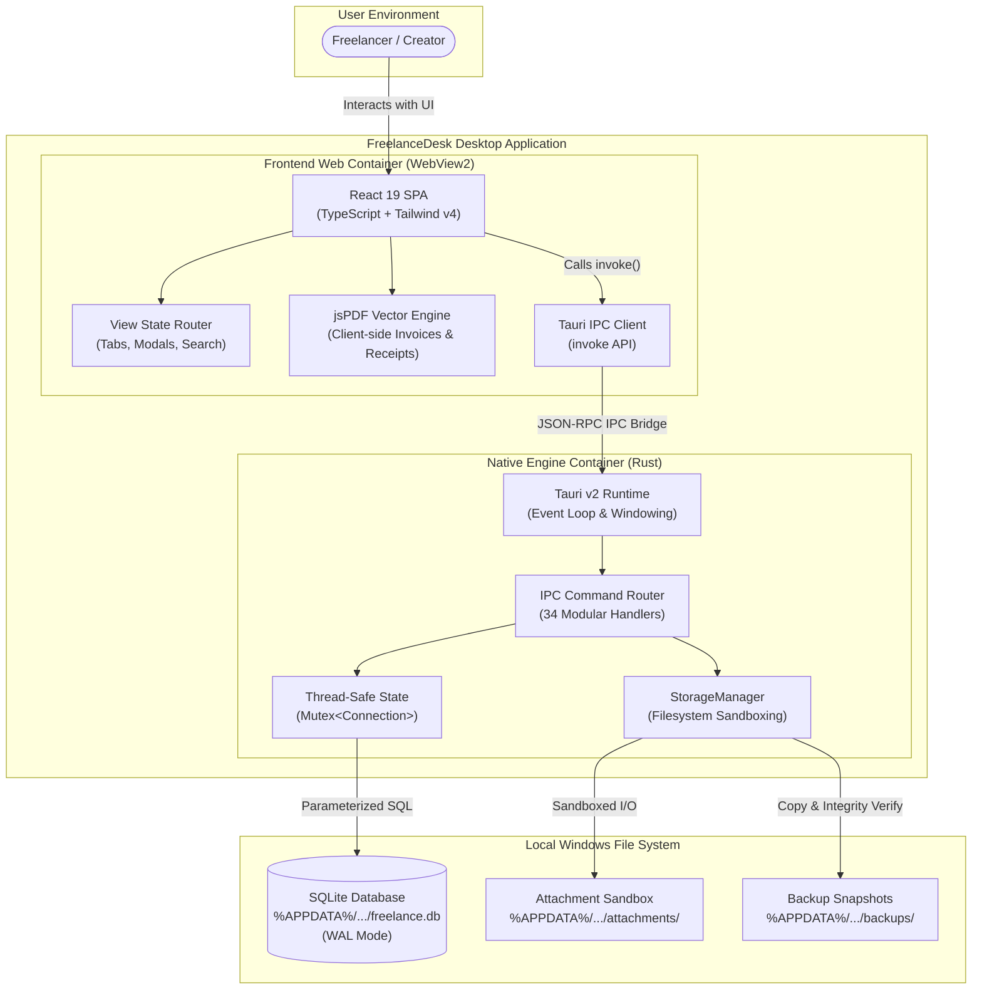
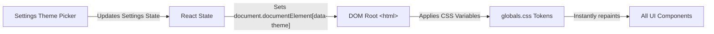
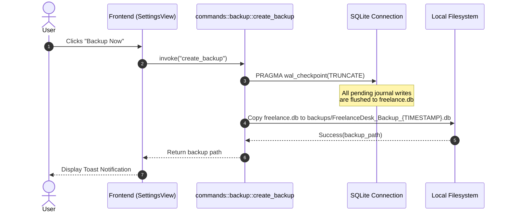

# Architecture & System Design

This document details the architectural principles, container structures, data flows, and security model of **FreelanceDesk**.

---

## 1. Architectural Tenets

FreelanceDesk is engineered around four core tenets:

1. **Local-First & Offline Resilience**: The application is entirely self-contained. The embedded database engine, assets, and document generators execute on the local workstation without any remote network dependencies.
2. **Zero-Overhead Native Shell**: Utilizing **Tauri v2** over WebView2, the application maintains a negligible memory footprint ($\approx 40{-}60\text{ MB}$) and fast startup times ($< 0.5\text{ s}$).
3. **Monetary Precision via Integer Arithmetic**: All monetary fields are strictly stored as 64-bit integer **cents** in SQLite and serialized as numbers, eliminating IEEE 754 floating-point rounding inaccuracies.
4. **Archival "Warm Paper" Design System**: The user interface is driven by a three-layer semantic CSS token system that transitions between physical paper bookkeeper aesthetics and high-contrast dark modes without layout shifts.

---

## 2. High-Level C4 Container Diagram



---

## 3. Frontend Architecture

The frontend is a single-page React 19 application built with TypeScript, located under `src/`.

### 3.1 Feature-Sliced Organization

The codebase is organized by business domain under `src/features/`, ensuring high cohesion and low coupling:

```
src/features/
├── calendar/          # Visual month view and deadline timeline
├── clients/           # Client directories, ledger profiles & contact cards
├── commissions/       # Commission lifecycles, milestones & job orders
├── dashboard/         # Financial KPI cards, active alerts & recent logs
├── expenses/          # Deductible expenses, categories & receipts
├── files/             # Document and attachment registry
├── invoices/          # Invoices listing, line items & PDF generation
├── payments/          # Payment transaction ledger & receipt generation
├── projects/          # High-level project groups
├── reports/           # Financial performance & tax reports
└── settings/          # Business profiles, theme switcher & backups
```

### 3.2 Design System & Three-Layer Token Architecture

Styling is implemented in `src/styles/globals.css` using Tailwind CSS v4 and a three-layer CSS variable token architecture:

1. **Primitive Tokens**: Concrete hex palettes (`--paper-50: #FAF8F5`, `--bronze-700: #854D0E`, `--charcoal-900: #1C1917`).
2. **Semantic Tokens**: Contextual abstraction layer:
   - `--bg-app`: Root window background.
   - `--bg-surface`: Card and modal container surface.
   - `--border-ledger`: Primary boundary border.
   - `--text-primary`: High-contrast body and heading typography.
   - `--accent`: Brand action highlight color.
3. **Component Tokens**: Targeted button, input, and table state variables.

#### Theme Switching Engine

Themes are toggled via the `data-theme` attribute on the `document.documentElement`:
- `data-theme="paper"` (Default): Artisanal warm ledger with cream background and bronze accents.
- `data-theme="clean"`: Cool neutral slate for modern minimalist aesthetics.
- `data-theme="dark"`: Obsidian charcoal (`#141312`) for low-light environments.



---

## 4. Native Backend Architecture (Rust + Tauri v2)

The native engine is written in Rust (2021 Edition) under `src-tauri/`.

### 4.1 Application Lifecycle & `AppState`

When the application boots:
1. `src-tauri/src/lib.rs` executes `tauri::Builder::default()`.
2. Resolves the Windows application data directory:
   `%APPDATA%\com.carlodandan.freelancedesk\`.
3. `StorageManager::init_directories` verifies or initializes the sandbox folder structure.
4. `database::init_database` opens or creates the SQLite database, establishes performance PRAGMAs (`WAL` mode, `foreign_keys = ON`), and executes pending migrations.
5. Injects the thread-safe `AppState` into Tauri's managed state:

```rust
pub struct AppState {
    pub db: Mutex<Connection>,
    pub app_data_dir: PathBuf,
    pub db_path: PathBuf,
}
```

### 4.2 Sandboxed Local Filesystem Layout

```
%APPDATA%/com.carlodandan.freelancedesk/
├── database/
│   ├── freelance.db            # Primary database file
│   ├── freelance.db-wal        # Write-Ahead Log
│   └── freelance.db-shm        # Shared-memory index
├── attachments/
│   ├── clients/                # Client attachments
│   ├── projects/               # Project-level briefs and documents
│   ├── commissions/            # Artwork files and reference assets
│   └── expenses/               # Digitized receipt snapshots
├── invoices/                   # Stored invoice records
├── receipts/                   # Stored receipt records
└── backups/                    # Manual and safety backup copies
```

### 4.3 Backup & Crash-Safe Restoration Flow

To ensure database consistency during live operation, backups use SQLite's Write-Ahead Log truncation checkpoint:



#### Safe Restoration Protocol

During `restore_backup`:
1. **Source Integrity Check**: Opens the selected backup file independently and runs `PRAGMA integrity_check;`. If the result is not `"ok"`, the restore aborts immediately.
2. **Safety Snapshot**: The active database is checkpointed and cloned to `backups/Safety_Backup_Before_Restore_{TIMESTAMP}.db`.
3. **Overwrite & Reconnect**: The verified backup overwrites `freelance.db`, and the mutex-protected connection re-initializes with strict foreign keys and WAL mode.

---

## 5. Vector PDF Generation Engine

PDF generation is performed entirely client-side using `jspdf` (`src/services/pdf.ts`), avoiding heavyweight headless browser dependencies.

### 5.1 Character Isolation & Encoding Safety

Default PDF standard fonts (Helvetica, Times) operate in Latin-1/WinAnsi encoding. Non-Latin Unicode glyphs (e.g. `₱` Unicode `\u20B1`) evaluate under 8-bit masking to `0xB1`, resulting in the `±` (plus-or-minus) character corruption.

`src/services/pdf.ts` employs `getPdfCurrency()` to safely map currency codes:
- `₱` $\rightarrow$ `"PHP "`
- `€` $\rightarrow$ `"EUR "`
- `$`, `£`, `¥` $\rightarrow$ Preserved as ASCII characters

### 5.2 Dynamic Flow & Margin Geometry

- **Table Rows**: Descriptions are wrapped using `doc.splitTextToSize(desc, 80)`. Row height adapts dynamically (`Math.max(9, lines.length * 4.5 + 4.5)`).
- **Descender Clearance**: Row dividing lines are offset to allow $2.3\text{ mm}$ minimum clearance below character descenders (`g`, `p`, `y`, `q`).
- **Total Due Card**: Formatted inside a warm paper highlight box (`#FAF8F5` surface, `#854D0E` bronze border) with $4.3\text{ mm}$ top margin and $2.3\text{ mm}$ bottom margin.

---

## 6. Security & Threat Model

| Threat | Mitigation Strategy |
|---|---|
| **SQL Injection** | 100% of SQLite database queries use parameterized prepared statements (`conn.prepare(...)` and `params![...]`). Raw string interpolation into SQL is strictly forbidden. |
| **Path Traversal** | Attachment uploads and file operations are resolved strictly against validated sandbox paths (`StorageManager`). |
| **Data Loss on Restore** | Automated safety snapshot created prior to any database overwrite. |
| **Cloud Surveillance** | Zero external HTTP requests; no third-party telemetry; no external web fonts or CDN scripts loaded at runtime. |
| **Monetary Calculation Drift** | Pure integer arithmetic in cents; zero floating-point math stored in database. |
