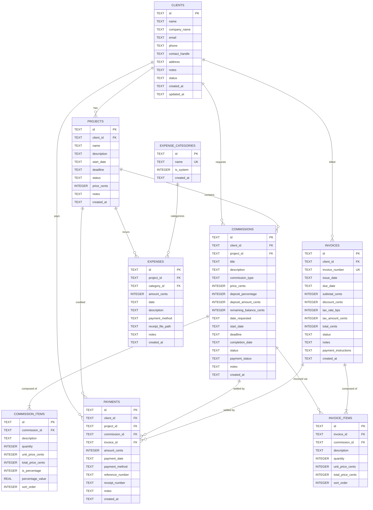

# SQLite Database Schema & Entity Relationships

This document details the relational data model, constraints, monetary conventions, and migration strategy of the **FreelanceDesk** embedded SQLite database.

---

## 1. Relational Principles & Architecture

The database is managed by `rusqlite` with SQLite 3 bundled directly into the compiled native binary.

* **Embedded Location**: `%APPDATA%/com.carlodandan.freelancedesk/database/freelance.db`
* **Performance PRAGMAs**:
  ```sql
  PRAGMA journal_mode = WAL;
  PRAGMA foreign_keys = ON;
  PRAGMA synchronous = NORMAL;
  ```
* **Primary Keys**: UUID v4 strings (`TEXT PRIMARY KEY`), generated natively in Rust.
* **Timestamps**: Stored in ISO-8601 UTC string format (`datetime('now')`), e.g., `2026-09-14 02:00:00`.
* **Monetary Representation**: Stored as 64-bit integer **cents** (`price_cents`, `subtotal_cents`, `amount_cents`), completely avoiding floating-point precision loss.
* **Tax Rates**: Stored in basis points (`tax_rate_bps`, where $100\text{ bps} = 1.0\%$).

---

## 2. Entity-Relationship Diagram (ERD)



---

## 3. Table Specifications

### 3.1 `clients`
Represents individual customers, creative patrons, or businesses. 

> [!NOTE]
> **At-Rest Field Encryption**: Sensitive fields (`email`, `phone`, `contact_handle`, `address`, `notes`) are encrypted with **AES-256-GCM** using the host workstation's Windows DPAPI vault key. Values are persisted as `enc:v1:<base64(12B nonce + ciphertext + 16B auth tag)>`. Plaintext values from legacy databases pass through transparently and are automatically migrated and sealed upon application startup.

| Column | Type | Constraints | Description |
|---|---|---|---|
| `id` | `TEXT` | `PRIMARY KEY` | Unique UUID v4 |
| `name` | `TEXT` | `NOT NULL` | Client's full name (Plaintext for fast relational joins) |
| `company_name` | `TEXT` | Nullable | Organization or studio name |
| `email` | `TEXT` | Nullable | Contact email (**AES-256-GCM encrypted** at rest) |
| `phone` | `TEXT` | Nullable | Contact phone number (**AES-256-GCM encrypted** at rest) |
| `contact_handle` | `TEXT` | Nullable | Discord tag, Twitter handle (**AES-256-GCM encrypted** at rest) |
| `address` | `TEXT` | Nullable | Billing address (**AES-256-GCM encrypted** at rest) |
| `notes` | `TEXT` | Nullable | Freelancer notes (**AES-256-GCM encrypted** at rest) |
| `status` | `TEXT` | `NOT NULL DEFAULT 'active'` | `'active'`, `'inactive'`, `'archived'` |
| `created_at` | `TEXT` | `NOT NULL DEFAULT (datetime('now'))` | Timestamp |
| `updated_at` | `TEXT` | `NOT NULL DEFAULT (datetime('now'))` | Timestamp |

---

### 3.2 `projects`
High-level project buckets that can contain multiple commissions or expenses.

| Column | Type | Constraints | Description |
|---|---|---|---|
| `id` | `TEXT` | `PRIMARY KEY` | Unique UUID v4 |
| `client_id` | `TEXT` | `NOT NULL REFERENCES clients(id) ON DELETE RESTRICT` | Associated client |
| `name` | `TEXT` | `NOT NULL` | Project title |
| `description` | `TEXT` | Nullable | Brief and scope |
| `start_date` | `TEXT` | Nullable | ISO-8601 Date (`YYYY-MM-DD`) |
| `deadline` | `TEXT` | Nullable | ISO-8601 Date (`YYYY-MM-DD`) |
| `status` | `TEXT` | `NOT NULL DEFAULT 'planning'` | `'planning'`, `'in_progress'`, `'waiting'`, `'completed'`, `'cancelled'`, `'archived'` |
| `price_cents` | `INTEGER` | `NOT NULL DEFAULT 0` | Total contract value in cents |
| `notes` | `TEXT` | Nullable | Internal notes |

---

### 3.3 `commissions`
Core job orders and deliverables requested by clients.

| Column | Type | Constraints | Description |
|---|---|---|---|
| `id` | `TEXT` | `PRIMARY KEY` | Unique UUID v4 |
| `client_id` | `TEXT` | `NOT NULL REFERENCES clients(id) ON DELETE RESTRICT` | Associated client |
| `project_id` | `TEXT` | `REFERENCES projects(id) ON DELETE SET NULL` | Optional parent project |
| `title` | `TEXT` | `NOT NULL` | Commission title |
| `description` | `TEXT` | Nullable | Deliverable description |
| `commission_type` | `TEXT` | Nullable | E.g. "Character Illustration", "Copywriting" |
| `price_cents` | `INTEGER` | `NOT NULL DEFAULT 0` | Agreed price in cents |
| `deposit_percentage` | `INTEGER` | `NOT NULL DEFAULT 50` | Upfront deposit percentage (0–100) |
| `deposit_amount_cents`| `INTEGER` | `NOT NULL DEFAULT 0` | Calculated deposit in cents |
| `remaining_balance_cents`| `INTEGER` | `NOT NULL DEFAULT 0` | Remaining balance in cents |
| `date_requested` | `TEXT` | Nullable | Date inquiry was received |
| `start_date` | `TEXT` | Nullable | Work kickoff date |
| `deadline` | `TEXT` | Nullable | Delivery deadline |
| `completion_date` | `TEXT` | Nullable | Actual finish date |
| `status` | `TEXT` | `NOT NULL DEFAULT 'inquiry'` | `'inquiry'`, `'quoted'`, `'confirmed'`, `'in_progress'`, `'for_review'`, `'revision'`, `'completed'`, `'cancelled'` |
| `payment_status` | `TEXT` | `NOT NULL DEFAULT 'unpaid'` | `'unpaid'`, `'deposit_paid'`, `'partially_paid'`, `'paid'`, `'refunded'` |

---

### 3.4 `commission_items`
Detailed line items for a commission order.

| Column | Type | Constraints | Description |
|---|---|---|---|
| `id` | `TEXT` | `PRIMARY KEY` | Unique UUID v4 |
| `commission_id` | `TEXT` | `NOT NULL REFERENCES commissions(id) ON DELETE CASCADE` | Parent commission |
| `description` | `TEXT` | `NOT NULL` | Item description |
| `quantity` | `INTEGER` | `NOT NULL DEFAULT 1` | Unit count |
| `unit_price_cents` | `INTEGER` | `NOT NULL DEFAULT 0` | Unit price in cents |
| `total_price_cents`| `INTEGER` | `NOT NULL DEFAULT 0` | Quantity * unit price |
| `is_percentage` | `INTEGER` | `NOT NULL DEFAULT 0` | 1 if percentage modifier |
| `percentage_value` | `REAL` | Nullable | Percentage amount |
| `sort_order` | `INTEGER` | `NOT NULL DEFAULT 0` | Display ordering |

---

### 3.5 `invoices` & `invoice_items`
Billing records and line-item breakdowns.

* `invoices.invoice_number` is protected by a `UNIQUE` constraint.
* `invoice_items` cascades deletion on `invoice_id` (`ON DELETE CASCADE`).
* Tax rates are stored in basis points (`tax_rate_bps`) to support accurate fractional percentages (e.g. $12.5\% = 1250\text{ bps}$).

---

### 3.6 `payments`
Recorded financial transactions from clients.

* Links to `client_id` with `ON DELETE RESTRICT` (a client with payments cannot be deleted).
* References to `project_id`, `commission_id`, and `invoice_id` are set to `NULL` if those entities are deleted (`ON DELETE SET NULL`), preserving the ledger transaction history.

---

### 3.7 `expenses` & `expense_categories`
Business deductible tracking.

* `expense_categories.name` is protected by a `UNIQUE` constraint.
* Pre-seeded with system categories: `Software & Subscriptions`, `Hardware & Equipment`, `Office Supplies`, `Internet & Utilities`, `Advertising & Marketing`, `Contractor & Legal`, `Education & Training`, `Travel & Meals`, `Banking & Fees`, `Other Expense`.

---

### 3.8 Auxiliary Tables

* **`attachments`**: Stores file metadata, mime type, byte size, and sandbox file paths tied to entities.
* **`activity_log`**: Append-only log of significant events (entity creation, payment receipt, status progression).
* **`settings`**: Key-value pair store for user configuration and local security state:
  * Profile identity, currency preferences, invoice prefixes, deposit rules, and active UI theme.
  * `local_vault_key`: Contains the 256-bit AES vault master key, encrypted via Windows DPAPI (`CryptProtectData`) and stored as a Base64-encoded string. Unprotected transparently on application startup.
* **`schema_migrations`**: Linear migration registry tracking applied database version scripts.

---

## 4. Foreign Key Constraints & Cascading Policy

| Foreign Key | Source Table | Target Table | On Delete Action | Rationale |
|---|---|---|---|---|
| `projects.client_id` | `projects` | `clients` | `RESTRICT` | Prevent accidental deletion of clients with active projects |
| `commissions.client_id` | `commissions` | `clients` | `RESTRICT` | Retain complete client ledger history |
| `commissions.project_id`| `commissions` | `projects` | `SET NULL` | Removing a project groups shouldn't delete individual jobs |
| `commission_items.commission_id` | `commission_items` | `commissions` | `CASCADE` | Items are strictly owned by parent commission |
| `invoices.client_id` | `invoices` | `clients` | `RESTRICT` | Prevent deletion of invoiced clients |
| `invoice_items.invoice_id` | `invoice_items` | `invoices` | `CASCADE` | Items are strictly owned by parent invoice |
| `payments.client_id` | `payments` | `clients` | `RESTRICT` | Financial ledger integrity |
| `expenses.category_id` | `expenses` | `expense_categories` | `RESTRICT` | Prevent orphan expenses without valid category |

---

## 5. Indexes for Performance

```sql
CREATE INDEX idx_clients_name ON clients(name);
CREATE INDEX idx_clients_status ON clients(status);
CREATE INDEX idx_projects_client ON projects(client_id);
CREATE INDEX idx_projects_status ON projects(status);
CREATE INDEX idx_commissions_client ON commissions(client_id);
CREATE INDEX idx_commissions_status ON commissions(status);
CREATE INDEX idx_payments_client ON payments(client_id);
CREATE INDEX idx_payments_date ON payments(payment_date);
CREATE INDEX idx_expenses_date ON expenses(date);
CREATE INDEX idx_invoices_client ON invoices(client_id);
CREATE INDEX idx_attachments_entity ON attachments(entity_type, entity_id);
CREATE INDEX idx_activity_created ON activity_log(created_at DESC);
```

---

## 6. Migration System

Database migrations are defined in `src-tauri/src/database/migrations.rs`. 

When the app launches:
1. SQLite opens or initializes `schema_migrations`.
2. Queries the highest recorded `version`.
3. Sequentially executes any higher version scripts within an atomic transaction.
4. Records the applied migration version and timestamp.
